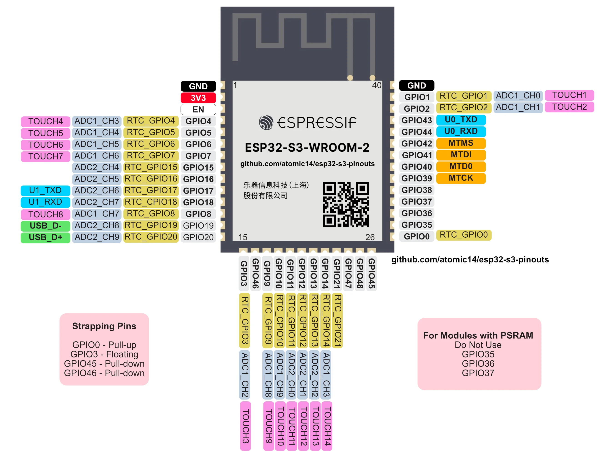

# Is this useful?

Feel free to open an issue or PR if you have any suggestions. And if you found it helpful then you might like to visit one of these links:

- atomic14 YouTube Channel: https://youtube.com/atomic14
- the atomic14 newsletter: https://atomic14.substack.com
- Patreon: https://www.patreon.com/atomic14

# ESP32-S3 Pinouts

I've always used this [Random Nerds page](https://randomnerdtutorials.com/esp32-pinout-reference-gpios/) as a reference for which ESP32 pins are safe to use.

But I haven't seen a similar one for the ESP32-S3 - so I thought I should make one!

The majority of this information is taken from the [ESP32-S3-WROOM datasheet](https://www.espressif.com/sites/default/files/documentation/esp32-s3-wroom-1_wroom-1u_datasheet_en.pdf) with additional information from the [ESP32-S3 datasheet](https://www.espressif.com/sites/default/files/documentation/esp32-s3_datasheet_en.pdf).

You can download a high resolution PDF version of this image [here](esp32.pdf).

The above image is a WROOM module with the pins labeled. Bold indicates the default behaviour of each pin. I've ommitted some of the more esoteric pins names, but you can find the full list in the datasheet.

There is a lot more flexibility with the ESP32-S3, so most pins can be used for any peripheral. However there are still some pins that have some funny behaviour.

# Strapping Pins

Avoid these unless you have no choice.

| Pin Name | Details                                                    |
|----------|------------------------------------------------------------|
| GPIO0    | Hold this low during boot to enter firmware download mode. |
| GPIO3    | In combination with eFuses controls the default behaviour of the JTAG pins. Probably ok to use unless you are messing with eFuses |
| GPIO45   | VDD_SPI - best leave this disconnected |
| GPIO46   | ROM messages printing - best to leave this disconnected as well. Causes issues with firmware download (see Boot Mode Control table below) |

You can use these pins as inputs or outputs once the ESP has booted. But be aware of the pull up/down resistors (see below).

If you want to use them as inputs, make sure you do not conflict with the default configurations during boot.

e.g. it's safe to have a button connected to GPIO0 and use that button in your code. But if you hold the button down during boot, it will enter firmware download mode.

If you want to use them as outputs, then be aware of the default pull up or pull down resistors.

## Boot Mode Control

| Boot Mode | GPIO0 | GPIO46 |
|-----------|-------|--------|
| SPI Boot (default)| 1 | Any value |
| Download Boot | 0  | 0 |
| Invalid combination | 0 | 1 |

## Strapping Pin Pull Up/Down Resistors

| Strapping Pin | Default Configuration | Bit Value |
|---------------|-----------------------|-----------|
GPIO0 | Pull-up | 1
GPIO3 | Floating | –
GPIO45 | Pull-down | 0
GPIO46 | Pull-down | 0

# I2S, I2C, SPI, UART, Remote Control etc...

These can use any GPIO pins on the ESP32-S3.

# Pins That You Need to be Careful With

# USB Data Pins

GPIO19, GPIO20 - these are both used for the USB connection.

# PSRAM

For modules that include Octal PSRAM (any module that has 8MB PSRAM) you **MUST NOT** use GPIO35, GPIO36 or GPIO37.

# JTAG Pins

GPIO39, GPIO40, GPIO41, GPIO42

The default behaviour of these pins is JTAG debugging, during firmware download mode they will have spurious values on them.

This can be turned off by burning some eFuses in conjunction with GPIO3 (see the datasheet for details).

# UART Pins

GPIO43, GPIO44

These default to UART0 until they are used by your code.

# ADC Pins

The ADC channels are all on fixed pins, and if you are using WiFi you cannot use ADC Unit 2

The pins for ADC Unit 1 are:

| GPIO Number | ADC Channel |
|-------------|-------------|
| GPIO1    | ADC1_CH0 |
| GPIO2    | ADC1_CH1 |
| GPIO3    | ADC1_CH2 |
| GPIO4    | ADC1_CH3 |
| GPIO5    | ADC1_CH4 |
| GPIO6    | ADC1_CH5 |
| GPIO7    | ADC1_CH6 |
| GPIO8    | ADC1_CH7 |
| GPIO9    | ADC1_CH8 |

# DAC Pins

There is NO DAC on the ESP32-S3 - you can simulate analog output using PWM or I2S PDM.

# Power Up Glitches

The following pins have glitches during power up.

GPIO1, GPIO2,GPIO3,GPIO4, GPIO5, GPIO6, GPIO7, GPIO8, GPIO9, GPIO10, GPIO11, GPIO12, GPIO13, GPIO14, GPIO15, GPIO16, GPIO17:
- Low-level glitch: the pin is at a low level output status for 60us.

GPIO18:
- Low-level glitch: the pin is at a low level output status for 60us.
- High-level glitch: the pin is at a high level output status for 60us.

GPIO19, GPIO20:
- Low-level glitch: the pin is at a low level output status for 60us.
- Two High-level glitches: the pin is at a high level output status for 60us.

See Table-2-2 [here](https://www.espressif.com/sites/default/files/documentation/esp32-s3_datasheet_en.pdf)

# Source Material

- [ESP32-S3-WROOM Datasheet](https://www.espressif.com/sites/default/files/documentation/esp32-s3-wroom-1_wroom-1u_datasheet_en.pdf)
- [ESP32-S3 Datasheet](https://www.espressif.com/sites/default/files/documentation/esp32-s3_datasheet_en.pdf)
- [ESP32-S3 Technical Reference Manual](https://www.espressif.com/sites/default/files/documentation/esp32-s3_technical_reference_manual_en.pdf)

# Excel Version With Multiple Modules

There's a really [handy spreadsheet here](ESP32-Pin-Allocation.xlsx) provided by Mark Nowell with lists of ESP32-S3 modules and their pinouts.

# Full GPIO Table

- I - input
- O - output
- T - tristate (high impedance)

| Pin Name | Pin Number |  Type |                                             Description                                            |
|:--------:|:----------:|:-----:|:--------------------------------------------------------------------------------------------------:|
| GND      | 1,40       | P     | **GND**                                                                                            |
| EPAD     | 41         | P     | **GND**                                                                                            |
| 3V3      | 2          | P     | **Power supply**                                                                                   |
| EN       | 3          | I     | High: on, enables the chip. Low: off, the chip powers off. Note: Do not leave the EN pin floating. |
| GPIO0    | 27         | I/O/T | RTC_GPIO0, **GPIO0**                                                                               |
| GPIO1    | 39         | I/O/T | RTC_GPIO1, **GPIO1**, TOUCH1, ADC1_CH0                                                             |
| GPIO2    | 38         | I/O/T | RTC_GPIO2, **GPIO2**, TOUCH2, ADC1_CH1                                                             |
| GPIO3    | 15         | I/O/T | RTC_GPIO3, **GPIO3**, TOUCH3, ADC1_CH2                                                             |
| GPIO4    | 4          | I/O/T | RTC_GPIO4, **GPIO4**, TOUCH4, ADC1_CH3                                                             |
| GPIO5    | 5          | I/O/T | RTC_GPIO5, **GPIO5**, TOUCH5, ADC1_CH4                                                             |
| GPIO6    | 6          | I/O/T | RTC_GPIO6, **GPIO6**, TOUCH6, ADC1_CH5                                                             |
| GPIO7    | 7          | I/O/T | RTC_GPIO7, **GPIO7**, TOUCH7, ADC1_CH6                                                             |
| GPIO8    | 12         | I/O/T | RTC_GPIO8, **GPIO8**, TOUCH8, ADC1_CH7, SUBSPICS1                                                  |
| GPIO9    | 17         | I/O/T | RTC_GPIO9, **GPIO9**, TOUCH9, ADC1_CH8, FSPIHD, SUBSPIHD                                           |
| GPIO10   | 18         | I/O/T | RTC_GPIO10, **GPIO10**, TOUCH10, ADC1_CH9, FSPICS0, FSPIIO4, SUBSPICS0                             |
| GPIO11   | 19         | I/O/T | RTC_GPIO11, **GPIO11**, TOUCH11, ADC2_CH0, FSPID, FSPIIO5, SUBSPID                                 |
| GPIO12   | 20         | I/O/T | RTC_GPIO12, **GPIO12**, TOUCH12, ADC2_CH1, FSPICLK, FSPIIO6, SUBSPICLK                             |
| GPIO13   | 21         | I/O/T | RTC_GPIO13, **GPIO13**, TOUCH13, ADC2_CH2, FSPIQ, FSPIIO7, SUBSPIQ                                 |
| GPIO14   | 22         | I/O/T | RTC_GPIO14, **GPIO14**, TOUCH14, ADC2_CH3, FSPIWP, FSPIDQS, SUBSPIWP                               |
| GPIO15   | 8          | I/O/T | RTC_GPIO15, **GPIO15**, U0RTS, ADC2_CH4, XTAL_32K_P                                                |
| GPIO16   | 9          | I/O/T | RTC_GPIO16, **GPIO16**, U0CTS, ADC2_CH5, XTAL_32K_N                                                |
| GPIO17   | 10         | I/O/T | RTC_GPIO17, **GPIO17**, U1TXD, ADC2_CH6                                                            |
| GPIO18   | 11         | I/O/T | RTC_GPIO18, **GPIO18**, U1RXD, ADC2_CH7, CLK_OUT3                                                  |
| USB_D-   | 13         | I/O/T | RTC_GPIO19, GPIO19, U1RTS, ADC2_CH8, CLK_OUT2, **USB_D-**                                          |
| USB_D+   | 14         | I/O/T | RTC_GPIO20, GPIO20, U1CTS, ADC2_CH9, CLK_OUT1, **USB_D+**                                          |
| GPIO21   | 23         | I/O/T | RTC_GPIO21, **GPIO21**                                                                             |
| GPIO35   | 28         | I/O/T | SPIIO6, **GPIO35**, FSPID, SUBSPID                                                                 |
| GPIO36   | 29         | I/O/T | SPIIO7, **GPIO36**, FSPICLK, SUBSPICLK                                                             |
| GPIO37   | 30         | I/O/T | SPIDQS, **GPIO37**, FSPIQ, SUBSPIQ                                                                 |
| GPIO38   | 31         | I/O/T | **GPIO38**, FSPIWP, SUBSPIWP                                                                       |
| MTCK     | 32         | I/O/T | **MTCK**, GPIO39, CLK_OUT3, SUBSPICS1                                                              |
| MTDO     | 33         | I/O/T | **MTDO**, GPIO40, CLK_OUT2                                                                         |
| MTDI     | 34         | I/O/T | **MTDI**, GPIO41, CLK_OUT1                                                                         |
| MTMS     | 35         | I/O/T | **MTMS**, GPIO42                                                                                   |
| U0TXD    | 37         | I/O/T | **U0TXD**, GPIO43, CLK_OUT1                                                                        |
| U0RXD    | 36         | I/O/T | **U0RXD**, GPIO44, CLK_OUT2                                                                        |
| GPIO45   | 26         | I/O/T | **GPIO45**                                                                                         |
| GPIO46   | 16         | I/O/T | **GPIO46**                                                                                         |
| GPIO47   | 24         | I/O/T | SPICLK_P_DIFF, **GPIO47**, SUBSPICLK_P_DIFF                                                        |
| GPIO48   | 25         | I/O/T | SPICLK_N_DIFF, **GPIO48**, SUBSPICLK_N_DIFF                                                        |

# Video Version

For people who prefer video content - you can wartch a video version [here](https://youtu.be/tC-DLeI6hjQ):

